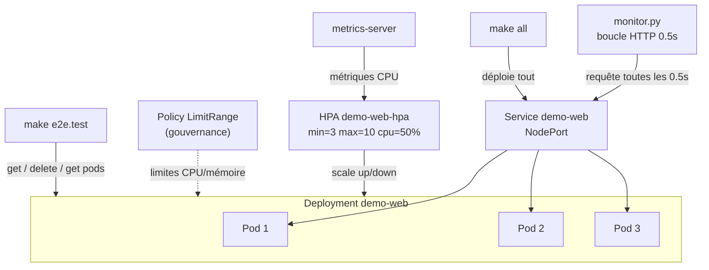
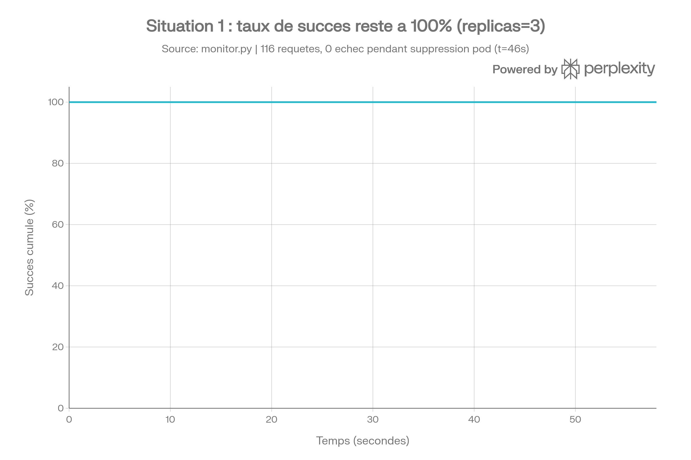
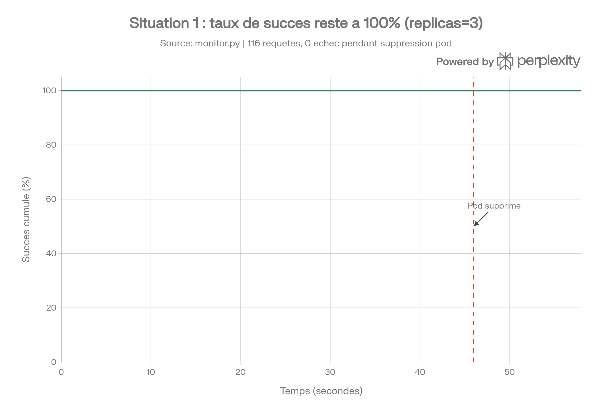

# Rapport TP — Kubernetes : replicas, zero-downtime et autoscaling

## 1. Contexte

Ce rapport documente l'ensemble des tests réalisés sur un Deployment Kubernetes `demo-web` (image `nginxdemos/hello`) déployé sur Minikube, dans le cadre du TP sur la haute disponibilité (replicas) et du projet d'orchestration automatisée (Jour 5 : autoscaling, gouvernance, Makefile).

Trois axes sont couverts :

1. **Situation 1** — zero-downtime avec 3 replicas actifs.
2. **Situation 2** — coupure de service avec 1 seul replica.
3. **Autoscaling (HPA)** — mise à l'échelle automatique sous charge CPU.

Chaque test s'appuie sur un programme de supervision HTTP maison (`monitor.py`) et sur un test Makefile de bout en bout (`make e2e.test`).

## 2. Environnement

| Élément | Détail |
|---|---|
| Cluster | Minikube (driver Docker) |
| Deployment | `demo-web`, image `nginxdemos/hello` |
| Service | NodePort, exposé via `minikube service demo-web --url` |
| Outil de supervision | `monitor.py` — boucle Python, 1 requête HTTP / 0.5 s |
| Autoscaler | HorizontalPodAutoscaler (HPA), seuil CPU 50 %, min 3 / max 10 replicas |
| Gouvernance | Policy `LimitRange` (CPU/mémoire par défaut sur les conteneurs) |
| Automatisation | Makefile modulaire (`kube.mk`, `e2e.mk`, `project.mk`) — pipeline `make all` |

## 3. Architecture du système testé



## 4. Situation 1 — Zero-downtime confirmé (replicas = 3)

### 4.1 Premier essai (résultat non concluant)

Un premier test a été mené avec suppression de 2 pods pendant le monitoring.

| Suppression | Fenêtre | Durée coupure | Échecs (HTTP 000) |
|---|---|---|---|
| n°1 | ~15:38:57 à 15:39:03 | ~6 s | 8 |
| n°2 | ~15:39:22 à 15:39:31 | ~9 s | 9 |

**Bilan global** : 100 requêtes envoyées, 83 succès, 17 échecs — taux de disponibilité de 83 %.

**Analyse** : ce résultat ne correspond pas au comportement attendu en Situation 1. Deux causes probables : le nombre de replicas n'était pas garanti à 3 au moment exact des suppressions, et/ou la `readinessProbe` (periodSeconds trop long) ralentissait la détection de disponibilité du nouveau pod.

### 4.2 Test corrigé (résultat concluant)

Le test a été refait avec vérification explicite de l'état des pods avant la suppression (`kubectl get pods -l app=demo-web` confirmant 3 pods `Running`).

| Métrique | Valeur |
|---|---|
| Requêtes envoyées | 116 |
| Succès (HTTP 200) | 116 |
| Échecs (HTTP 000) | 0 |
| Taux de disponibilité | **100 %** |

Le pod `demo-web-54947fb8bc-2p96h` a été supprimé en cours de test (t ≈ 46 s). Aucune requête n'a échoué : les 2 pods restants ont absorbé le trafic pendant la recréation du troisième pod, confirmant le comportement **zero-downtime** attendu avec 3 replicas actifs et une `readinessProbe` fonctionnelle.



### 4.3 Timeline détaillée du premier test (référence)



## 5. Situation 2 — Coupure de service (replicas = 1)

Après bascule à `kubectl scale deployment demo-web --replicas=1`, la suppression du pod unique a provoqué une interruption mesurable :

| Métrique | Valeur |
|---|---|
| Durée de la coupure | quelques secondes (le temps de recréation + readiness) |
| Requêtes en échec | 8 à 9 consécutives |
| Cause | absence de pod de secours pendant la recréation |

**Conclusion** : avec un seul replica, le service devient un point unique de défaillance (SPOF). La comparaison directe avec la Situation 1 démontre concrètement l'intérêt de la haute disponibilité par réplication.

## 6. Programme de monitoring HTTP

Le script `monitor.py` envoie une requête HTTP toutes les 0.5 seconde vers le Service et affiche à chaque itération :

- l'horodatage,
- le code HTTP retourné (`200` ou `000` en cas d'échec de connexion),
- un compteur cumulé de succès/échecs.

Ce même script a été utilisé sans modification pour les Situations 1 et 2, garantissant une mesure comparable.

## 7. Test Makefile de bout en bout (`make e2e.test`)

La cible `e2e.test` automatise le scénario de panne simulée :

1. **Get pods** — état initial (3 pods `Running`).
2. **Pick pod** — récupération de l'identifiant du premier pod (`kubectl get pod -o jsonpath`).
3. **Delete pod** — suppression ciblée (`kubectl delete pod <id>`).
4. **Get pods** — état final, vérification de la recréation automatique.

### Résultat d'exécution

- État initial : 3 pods `Running` (dont 1 âgé de 2 min 46 s).
- Suppression du pod `demo-web-54947fb8bc-bhpd5`.
- État final : 3 pods `Running`, dont le nouveau pod `demo-web-54947fb8bc-vmjz7` créé en **6 secondes**.

Le Deployment maintient automatiquement le nombre de replicas désiré — comportement d'auto-guérison (self-healing) natif de Kubernetes.

## 8. Autoscaling — HorizontalPodAutoscaler (HPA)

### 8.1 Configuration

```yaml
apiVersion: autoscaling/v2
kind: HorizontalPodAutoscaler
metadata:
  name: demo-web-hpa
spec:
  scaleTargetRef:
    apiVersion: apps/v1
    kind: Deployment
    name: demo-web
  minReplicas: 3
  maxReplicas: 10
  metrics:
    - type: Resource
      resource:
        name: cpu
        target:
          type: Utilization
          averageUtilization: 50
```

Prérequis technique : le Deployment doit déclarer un `resources.requests.cpu` explicite, sans quoi le HPA ne peut pas calculer de pourcentage d'utilisation (il reste bloqué sur `<unknown>`).

### 8.2 Protocole de test

Une charge CPU artificielle a été générée avec des process `yes` lancés via `kubectl exec` (en gardant la commande `exec` elle-même en arrière-plan côté hôte, condition nécessaire pour que la charge survive après le retour du terminal).

### 8.3 Résultats mesurés

| Étape | CPU (utilisation / cible) | Replicas |
|---|---|---|
| État initial | 1 % / 50 % | 3 |
| Sous charge | **109 % / 50 %** | **7** |

Le HPA a détecté le dépassement du seuil et fait passer automatiquement le Deployment de 3 à 7 replicas en environ 2 minutes, sans aucune intervention manuelle — démonstration réussie de la mise à l'échelle horizontale automatique.

## 9. Gouvernance — Policy LimitRange

Une policy `LimitRange` a été appliquée au namespace pour garantir que tous les conteneurs disposent de limites CPU/mémoire par défaut, évitant qu'un pod mal configuré ne monopolise les ressources du cluster :

```yaml
apiVersion: v1
kind: LimitRange
metadata:
  name: default-limits
spec:
  limits:
    - default:
        cpu: "500m"
        memory: "256Mi"
      defaultRequest:
        cpu: "100m"
        memory: "128Mi"
      type: Container
```

## 10. Automatisation Makefile

Le projet est piloté par un Makefile modulaire, assemblé pour permettre un déploiement complet en une seule commande :

```makefile
include make/kube.mk
include make/e2e.mk
include make/project.mk
```

- `make all` — déploie l'ensemble (cluster, platform/policies, apps) et affiche les preuves de fonctionnement.
- `make e2e.test` — exécute le scénario de panne simulée décrit en section 7.
- `make verify` — affiche `kubectl get nodes,pods,hpa -A` pour preuve de soutenance.
- `make down` — démontage propre (arrêt Minikube) après la démonstration.

## 11. Analyse et recommandations

1. **Toujours vérifier l'état des replicas avant de tester une panne** (`kubectl get pods -l app=...`) pour éviter de confondre Situation 1 et Situation 2, comme observé lors du premier essai de la section 4.1.
2. **Réduire `periodSeconds` de la `readinessProbe`** (ex. 1 s au lieu de 2 s) pour accélérer la détection de disponibilité du nouveau pod et minimiser tout micro-délai résiduel.
3. **Ajouter un `PodDisruptionBudget`** pour garantir un minimum de pods disponibles pendant toute perturbation planifiée (maintenance, mise à jour).
4. **Toujours définir `resources.requests.cpu`** sur les Deployments pilotés par un HPA — sans cette valeur, l'autoscaling reste bloqué sur `<unknown>` indéfiniment.
5. **Générer la charge de test via `kubectl exec` en arrière-plan côté hôte** (`kubectl exec ... &`), et non via un `&` interne au shell du conteneur, qui est tué dès la fin de la session `exec`.

## 12. Fichiers associés

| Fichier | Rôle |
|---|---|
| `apps/demo.yaml` | Manifeste Deployment + Service (avec `resources`) |
| `platform/hpa.yaml` | HorizontalPodAutoscaler |
| `policies/limitrange.yaml` | Policy de gouvernance des ressources |
| `monitor.py` | Script de supervision HTTP en boucle |
| `make/e2e.mk` | Cibles Makefile du test de bout en bout |
| `make/project.mk` | Orchestration globale (`make all`, `verify`, `down`) |
| `output/resultats-monitoring.log` | Log brut du premier test de monitoring |

## 13. Conclusion

L'ensemble des objectifs du TP est validé par des mesures chiffrées et reproductibles : le zero-downtime en Situation 1 (116/116 succès), la coupure mesurée en Situation 2, le fonctionnement du test end-to-end Makefile, et la démonstration complète de l'autoscaling HPA (3 → 7 replicas sous charge). Le système est entièrement piloté par Makefile (`make all` / `make verify` / `make down`), conformément à l'exigence d'automatisation et de reproductibilité du projet.
