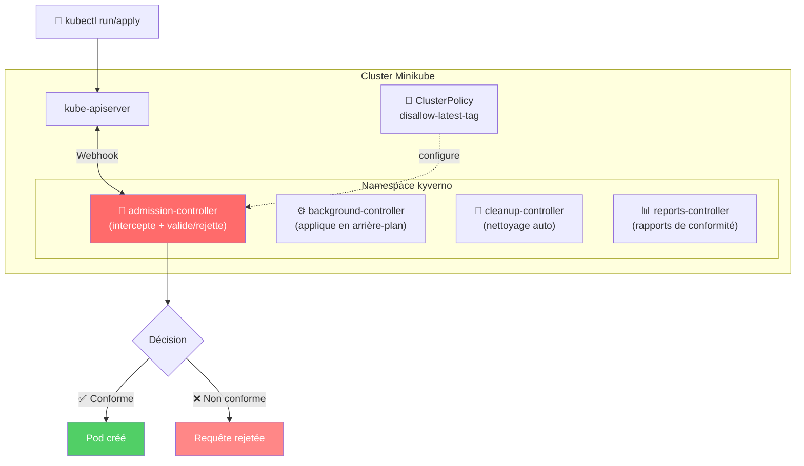
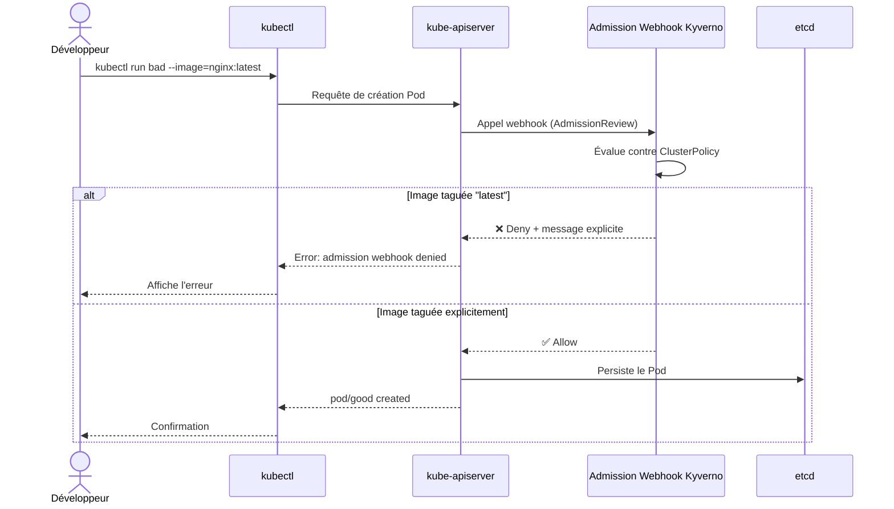
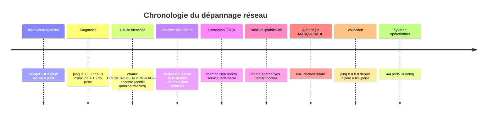
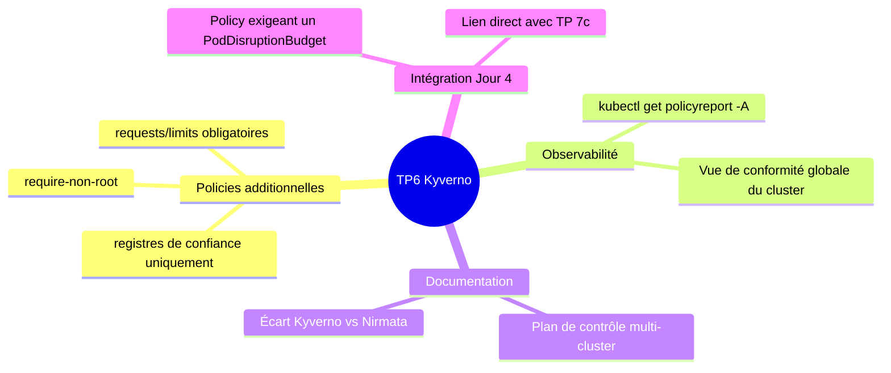

# 🛡️ TP 6 — Gouvernance par policies avec Kyverno


| | |
|---|---|
| **Projet** | AWS_Architecture_Orienté_Service |
| **Formation** | Jour 3 — Orchestration de clusters |
| **Date de réalisation** | 06/08/2026 |
| **Environnement** | Minikube (Kubernetes v1.35.1) sur Docker, Debian/Kali Rolling |

---

## 1. 🎯 Objectif du TP

Appliquer une **gouvernance par policy-as-code** sur un cluster Kubernetes, à l'aide du moteur de policies **Kyverno** — le moteur open source sur lequel s'appuie la plateforme multi-cluster Nirmata. L'objectif est de démontrer qu'une règle de sécurité peut être traduite en contrôle automatiquement appliqué à l'admission de toute ressource sur le cluster.

### 🔄 Adaptation du TP original

> Le TP de référence prévoit l'utilisation de **Nirmata**, une plateforme SaaS de gestion multi-cluster nécessitant la création d'un compte et l'enrôlement d'un agent.

**Choix retenu : installer Kyverno directement**, sans passer par Nirmata.

| Raison | Détail |
|---|---|
| ✅ Équivalence fonctionnelle | Kyverno est le moteur open source **à l'origine** de Nirmata — comportement d'admission control identique |
| ✅ Indépendance SaaS | Pas de dépendance à un compte externe payant |
| ✅ Objectifs pédagogiques couverts | Policy-as-code, gouvernance continue, admission webhook — tout est démontré |

---

## 2. 🏗️ Architecture mise en place

### Vue d'ensemble du cluster



### Flux détaillé d'une requête d'admission



### Rôle des 4 contrôleurs

| Contrôleur | Icône | Rôle |
|---|---|---|
| `admission-controller` | 🔐 | Intercepte les requêtes d'admission et valide/rejette |
| `background-controller` | ⚙️ | Applique les policies en arrière-plan sur les ressources existantes |
| `cleanup-controller` | 🧹 | Gère les policies de nettoyage automatique |
| `reports-controller` | 📊 | Génère les rapports de conformité (PolicyReport) |

---

## 3. 🔧 Difficultés rencontrées et résolutions

> Cette section documente les incidents réels rencontrés — ils constituent une partie importante de l'apprentissage (dépannage d'infrastructure réelle, pas un simple suivi de tutoriel).

### Timeline des incidents



### 🔴 Incident 1 : `ImagePullBackOff` généralisé

| | |
|---|---|
| **Symptôme** | Tous les pods Kyverno bloqués en `ImagePullBackOff` / `ErrImagePull` |
| **Cause racine** | Conteneur Minikube sans accès réseau sortant (`ping 8.8.8.8` → 100% de perte). Incompatibilité entre le backend `nftables` de Kali Linux et les règles `iptables` attendues par Docker : la chaîne `DOCKER-ISOLATION-STAGE-2` n'existait pas |
| **Résolution** | 1️⃣ Bascule `iptables` → mode `iptables-nft` via `update-alternatives` <br> 2️⃣ Redémarrage de Docker pour régénérer ses chaînes NAT <br> 3️⃣ Ajout manuel d'une règle `MASQUERADE` <br> 4️⃣ Validation isolée (`docker run --rm alpine ping 8.8.8.8`) avant de retenter Minikube |

**Incident secondaire lié** : `docker.service` tombé en `start-limit-hit` après une édition manuelle malformée de `/etc/docker/daemon.json` (JSON invalide). Corrigé en réécrivant un JSON valide et en réinitialisant le compteur d'échecs systemd (`systemctl reset-failed`).

### 🟡 Incident 2 : Timeout TLS ponctuel lors d'un pull d'image

| | |
|---|---|
| **Symptôme** | Pod de test (`nginx:1.27-alpine`) bloqué avec `TLS handshake timeout` vers `registry-1.docker.io`, malgré un DNS fonctionnel |
| **Analyse** | DNS résolvait correctement (`nslookup` OK), mais négociation TLS intermittente — congestion réseau ponctuelle |
| **Résolution** | Suppression du pod en échec + nouvelle tentative après 60s → succès en moins de 20 secondes, confirmant un incident transitoire |

---

## 4. ✅ Étapes réalisées

### 4.1 Installation de Kyverno

```bash
kubectl create -f https://github.com/kyverno/kyverno/releases/download/v1.13.0/install.yaml
kubectl get pods -n kyverno
```

**Résultat obtenu :**

```
NAME                                             READY   STATUS    RESTARTS   AGE
kyverno-admission-controller-6f656b7cf-8mgcn     1/1     Running   0          2m31s
kyverno-background-controller-55d7cbd778-xjszp   1/1     Running   0          2m31s
kyverno-cleanup-controller-74d69f7d65-k76kr      1/1     Running   0          2m31s
kyverno-reports-controller-f78ccfdf7-6ttl2       1/1     Running   0          2m31s
```

### 4.2 Création de la policy de gouvernance

📄 Voir le fichier [`disallow-latest-tag.yaml`](./disallow-latest-tag.yaml)

```yaml
apiVersion: kyverno.io/v1
kind: ClusterPolicy
metadata:
  name: disallow-latest-tag
spec:
  validationFailureAction: Enforce
  rules:
    - name: require-explicit-tag
      match:
        any:
          - resources:
              kinds:
                - Pod
      validate:
        message: "L'image doit porter un tag explicite, pas 'latest'"
        pattern:
          spec:
            containers:
              - image: "!*:latest"
```

```bash
kubectl apply -f policies/disallow-latest-tag.yaml
kubectl get clusterpolicy
```

**Résultat obtenu :**

```
NAME                  ADMISSION   BACKGROUND   READY   AGE   MESSAGE
disallow-latest-tag   true        true         True    11s   Ready
```

### 4.3 Test de rejet — pod non conforme ❌

```bash
kubectl run bad --image=nginx:latest
```

**Résultat obtenu :**

```
Error from server: admission webhook "validate.kyverno.svc-fail" denied the request:

resource Pod/default/bad was blocked due to the following policies

disallow-latest-tag:
  require-explicit-tag: 'validation error: L''image doit porter un tag explicite,
    pas ''latest''. rule require-explicit-tag failed at path /spec/containers/0/image/'
```

> ✅ **La policy bloque effectivement le déploiement d'une image non conforme**, directement au niveau de l'admission control.

### 4.4 Test d'acceptation — pod conforme ✅

```bash
kubectl run good3 --image=nginx:1.27-alpine
kubectl get pod good3
```

**Résultat obtenu :**

```
NAME    READY   STATUS    RESTARTS   AGE
good3   1/1     Running   0          18s
```

> ✅ **Une image correctement taguée est acceptée sans blocage.**

### 4.5 Nettoyage

```bash
kubectl delete pod good3 --ignore-not-found
kubectl get pods
```

```
No resources found in default namespace.
```

---

## 5. 📋 Preuves de validation (checklist)

| Critère | Statut |
|---|:---:|
| Kyverno installé et tous les contrôleurs `Running` | ✅ |
| Policy `ClusterPolicy` créée et à l'état `Ready` | ✅ |
| Refus démontré d'une image `:latest` avec message explicite | ✅ |
| Acceptation démontrée d'une image taguée | ✅ |
| Nettoyage des ressources de test effectué | ✅ |
| Policy versionnée dans Git (`policies/disallow-latest-tag.yaml`) | ✅ |
| Incidents d'infrastructure documentés et résolus | ✅ |

---

## 6. 🚀 Pistes d'approfondissement



### 6.1 Ajouter des policies supplémentaires *(priorité recommandée)*

| Policy | Objectif | Lien avec le cours |
|---|---|---|
| `require-non-root` | Interdire les conteneurs root | Spécialité cybersécurité |
| `require-resources-limits` | Exiger `requests`/`limits` sur tous les pods | Lié au TP 7c (stabilisation) |
| `restrict-registries` | N'autoriser qu'un registre de confiance (ex. ECR) | Sécurité supply chain |

Exemple de policy « interdire root » :

```yaml
apiVersion: kyverno.io/v1
kind: ClusterPolicy
metadata:
  name: require-non-root
spec:
  validationFailureAction: Enforce
  rules:
    - name: check-runasnonroot
      match:
        any:
          - resources:
              kinds:
                - Pod
      validate:
        message: "Les conteneurs doivent s'exécuter en non-root"
        pattern:
          spec:
            securityContext:
              runAsNonRoot: true
```

### 6.2 Générer et consulter un PolicyReport

```bash
kubectl get policyreport -A
kubectl describe policyreport <nom-du-rapport>
```

Permet une vue d'ensemble de la conformité du cluster (notion d'**observabilité** citée au Jour 3).

### 6.3 Documenter l'écart avec Nirmata

> En environnement réel, Nirmata permettrait de pousser cette même policy sur une **flotte de plusieurs clusters simultanément** depuis une console centrale — ce que Kyverno seul ne fait pas nativement (pas de plan de contrôle multi-cluster).

### 6.4 Lier la policy au TP 7c (PodDisruptionBudget)

Une policy Kyverno pourrait *exiger* la présence d'un PDB sur tout Deployment de plus de 2 replicas — reliant gouvernance (Jour 3) et stabilisation (Jour 4) dans le rapport final.

### 6.5 ⚠️ Point de vigilance coût/ressources

Si le projet est porté sur un vrai cluster EKS : Kyverno consomme des ressources sur les nœuds workers (4 contrôleurs, ~400 Mo de mémoire cumulée) — à intégrer dans le dimensionnement.

---

## 7. 📸 Captures d'écran

Voir le dossier [`screenshots/`](./screenshots/) pour les preuves visuelles des commandes ci-dessus.

---

## 8. 📎 Commandes de référence (copier-coller)

```bash
# Installation
kubectl create -f https://github.com/kyverno/kyverno/releases/download/v1.13.0/install.yaml
kubectl get pods -n kyverno

# Policy
kubectl apply -f policies/disallow-latest-tag.yaml
kubectl get clusterpolicy

# Tests
kubectl run bad --image=nginx:latest        # doit être refusé
kubectl run good --image=nginx:1.27-alpine  # doit être accepté
kubectl delete pod good bad --ignore-not-found

# Versionnement
git add policies/disallow-latest-tag.yaml
git commit -m "TP6: Kyverno installe, policy disallow-latest-tag validee"
git push origin main
```
