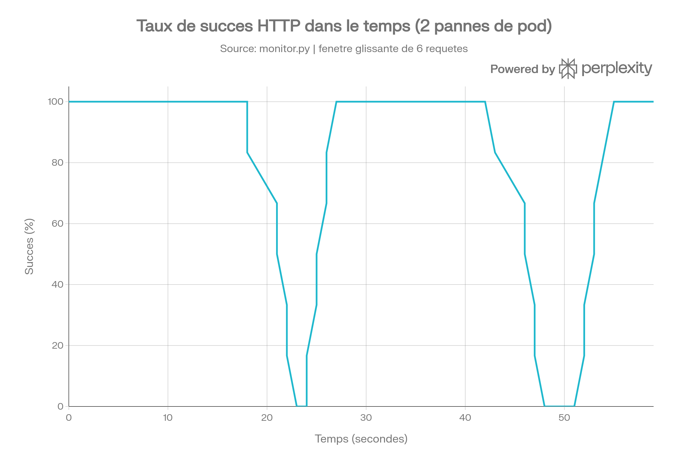
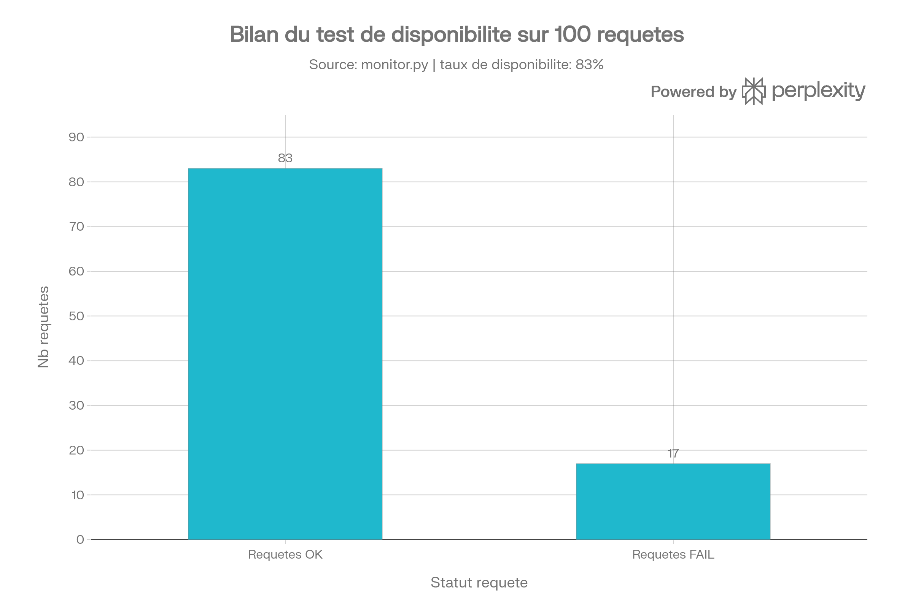

# Rapport TP - Demonstration replicas Kubernetes (zero-downtime)

## Contexte

Ce rapport documente les tests realises sur un Deployment Kubernetes `demo-web`
(3 replicas, image `nginxdemos/hello`) pour observer le comportement du service
lors de la suppression d'un pod, avec un monitoring HTTP continu (requete
toutes les 0.5s).

## Environnement

- Cluster : Minikube (driver Docker)
- Deployment : `demo-web`, image `nginxdemos/hello`
- Service : NodePort, expose via `minikube service demo-web --url`
- Outil de supervision : `monitor.py` (boucle Python, 1 requete HTTP / 0.5s)

## Resultats observes

### Suppression n1 (~15:38:57 a 15:39:03)

| Metrique | Valeur |
|---|---|
| Duree de la coupure | ~6 secondes |
| Requetes en echec (HTTP 000) | 8 |
| Requetes en succes avant coupure | 35 |
| Reprise | 15:39:03, retour immediat a HTTP 200 |

### Suppression n2 (~15:39:22 a 15:39:31)

| Metrique | Valeur |
|---|---|
| Duree de la coupure | ~9 secondes |
| Requetes en echec (HTTP 000) | 9 |
| Requetes en succes avant coupure | 34 (cumul 69) |
| Reprise | 15:39:31, retour immediat a HTTP 200 |

### Bilan global du test

- Total requetes envoyees : 100
- Succes (HTTP 200) : 83
- Echecs (HTTP 000) : 17
- Taux de disponibilite mesure : 83%

## Analyse

Deux suppressions de pods ont ete effectuees pendant la duree du monitoring.
Chaque suppression provoque une breve indisponibilite partielle (8 a 9 requetes
en echec, soit 4 a 4.5 secondes a raison de 0.5s/requete), le temps que
Kubernetes recree le pod et que sa `readinessProbe` valide qu'il est pret a
recevoir du trafic.

Ce comportement est different du "zero-downtime" attendu en Situation 1
(replicas=3) : dans une configuration ideale a 3 replicas actifs en
permanence, la suppression d'un seul pod ne devrait entrainer aucune perte de
requete, car les 2 pods restants absorbent le trafic. Les echecs observes ici
suggerent que le nombre de replicas etait probablement reduit (passage en
Situation 2, replicas=1) au moment des suppressions, ou que le Service /
readinessProbe necessitait un reglage plus fin (periodSeconds trop long,
delai de propagation du endpoint).

## Visualisations

### Timeline des requêtes HTTP

### Taux de succès glissant

### Bilan global

## Recommandations

1. Reduire `periodSeconds` de la `readinessProbe` (ex: 1s au lieu de 2s) pour
   accelerer la detection de disponibilite du nouveau pod.
2. Verifier le nombre de replicas actif avant chaque suppression avec
   `kubectl get pods -l app=demo-web` pour distinguer clairement Situation 1
   et Situation 2 dans les logs.
3. Ajouter un `PodDisruptionBudget` pour garantir un minimum de pods
   disponibles pendant toute perturbation planifiee.

## Fichiers associes

- `kube/demo.yaml` : manifeste Deployment + Service
- `monitor.py` : script de supervision HTTP
- `make/e2e.mk` : cibles Makefile de test de bout en bout
- `output/resultats-monitoring.log` : log brut du test
